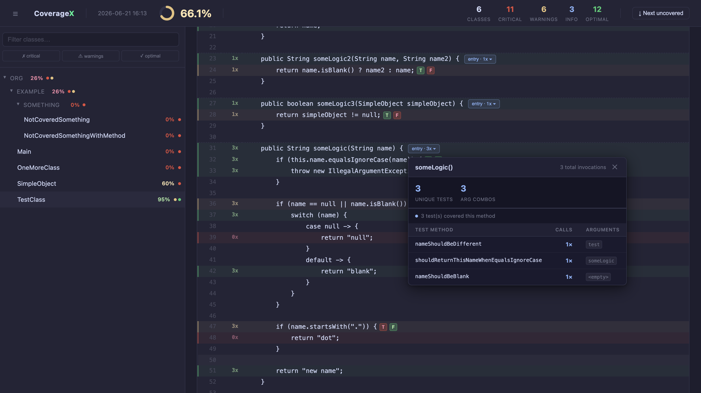

# CoverageX

**Coverage that explains the test story behind the percentage.**



CoverageX is a coverage tool built for teams that want to dive deeper into their product’s quality. It gives engineering teams a clearer view of test coverage beyond a simple percentage.

CoverageX makes tests and quality easier to reason about by answering questions like:

- What code is covered by tests?
- Which methods were covered, and how?
- Which conditional branches were missed?
- Which argument combinations reached a method?
- Which tests are responsible for probe activity when test tracking is enabled?
- And much more!

> CoverageX is under active development. We are thankful for using the software but there can be always bugs and unexpected issues.
> We use GitHub Issues as the central place for bug reports, feature requests, improvements, and suggestions.
> When opening an issue, please include enough context for us to understand the problem or idea, and add reproduction steps for bugs whenever possible.

### Known issues
- Objects observability (objects' structure won't be shown in reports unless an object implements a toString method)
- main() methods are included in the report as not covered.

### Planned features that are not implemented yet
- Multi module projects reporting
- Kotlin support
- Spring boot/Quarkus/Micronaut extensions
- Other testing frameworks support
- Any helpful features requested by the community :)

## Requirements
- JDK 21 or newer
- Maven 3.9+

## License

CoverageX is licensed under the Functional Source License, Version 1.1, with
Apache-2.0 as the future license. See `LICENSE.md` for the full license text.

The license allows use for any permitted purpose other than a competing use.
Commercial, internal, evaluation, educational, research, and professional
services use may be allowed when it does not compete with CoverageX.

## Modules

| Module                          | Purpose                                                                            |
|---------------------------------|------------------------------------------------------------------------------------|
| `coveragex-api`                 | Shared public model, agent options, execution data reader/writer, coverage metrics |
| `coveragex-core`                | Source mapping, enrichment, report pipeline, HTML and console rendering            |
| `coveragex-agent`               | JVM agent, bytecode transformer, probe injection, runtime collection               |
| `coveragex-maven-plugin`        | Maven goals for analyze, prepare-agent, enrich, and report                         |
| `coveragex-test-api`            | Framework-neutral test context SPI and propagation helpers                         |
| `coveragex-compatability-tests` | Tests that verify operators/aspects per JDK version                                |
| `coveragex-test-fixtures-*`     | Modules per JDK version operators                                                  |
| `coveragex-test-junit5`         | JUnit 5 integration for test attribution                                           |

## Requirements

- JDK 21 or newer for building CoverageX
- Maven 3.9+ for the core multi-module build
- Gradle wrapper in `coveragex-gradle` for the Gradle plugin
- A Java project with compiled production classes and tests

## Build From Source

```bash
mvn -f coveragex/pom.xml clean install
```

## Maven Quick Start

Add the Maven plugin to the project you want to measure:

```xml
<build>
    <plugins>
        <plugin>
            <groupId>com.coveragex</groupId>
            <artifactId>coveragex-maven-plugin</artifactId>
            <version>0.1.0-SNAPSHOT</version>
            <configuration>
                <reportFormats>html</reportFormats>
                <enableInvocationTracking>true</enableInvocationTracking>
                <enableInsights>true</enableInsights>
                <enableSuggestions>true</enableSuggestions>
                <enableOverCoverageAnalysis>true</enableOverCoverageAnalysis>
                <includes>
                    <include>org.example.**</include>
                </includes>
                <excludes>
                    <exclude>**.Test</exclude>
                    <exclude>**.*Test</exclude>
                    <exclude>**.Tests</exclude>
                    <exclude>**.*Tests</exclude>
                </excludes>
            </configuration>
            <executions>
                <execution>
                    <goals>
                        <goal>analyze</goal>
                        <goal>prepare-agent</goal>
                        <goal>enrich</goal>
                        <goal>report</goal>
                    </goals>
                </execution>
            </executions>
        </plugin>
    </plugins>
</build>
```

## Test Attribution

CoverageX keeps test identity separate from the agent core. You can expand reports with test names by including the following dependency (for now only JUnit 5 is supported but other tools will be available soon)

Add the test integration module in test scope:

```xml
<dependency>
  <groupId>com.coveragex</groupId>
  <artifactId>coveragex-test-junit5</artifactId>
  <version>0.1.0-SNAPSHOT</version>
  <scope>test</scope>
</dependency>
```