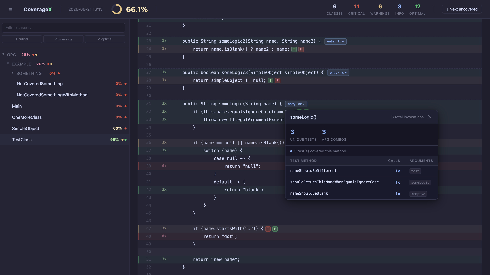

# CoverageX

**Coverage that explains the test story behind the percentage.**



CoverageX is a coverage tool built for teams that want to dive deeper into their product’s quality. It gives engineering teams a clearer view of test coverage beyond a simple percentage by generating an HTML report to easily identify any problems or misses in your codebase.

CoverageX makes tests and quality easier to reason about by answering questions like:

- What code is covered by tests?
- Which methods were covered, and how?
- Which conditional branches were missed?
- Which argument combinations reached a method?
- Which tests are responsible for probe activity when test tracking is enabled?
- And much more!

> CoverageX is under active development. We are thankful for using the software but there can be always bugs and unexpected issues.
> We use GitHub Issues as the central place for bug reports, feature requests, improvements, and suggestions.
> When opening an issue, please include enough context for us to understand the problem or idea, and add reproduction steps for bugs whenever possible.

### Known issues
- Objects observability (objects' structure won't be shown in reports unless an object implements a toString method)
- main() methods are included in the report as not covered.

### Planned features that are not implemented yet
- Kotlin support
- Spring boot/Quarkus/Micronaut extensions
- Other testing frameworks support
- Any helpful features requested by the community :)

## Requirements
- JDK 21 or newer
- Maven 3.9+, **or** Gradle 9.0+

## License

CoverageX is licensed under the Functional Source License, Version 1.1, with
Apache-2.0 as the future license. See `LICENSE.md` for the full license text.

The license allows use for any permitted purpose other than a competing use.
Commercial, internal, evaluation, educational, research, and professional
services use may be allowed when it does not compete with CoverageX.

## Modules

| Module                          | Purpose                                                                            |
|---------------------------------|------------------------------------------------------------------------------------|
| `coveragex-api`                 | Shared public model, agent options, execution data reader/writer, coverage metrics |
| `coveragex-core`                | Source mapping, enrichment, report pipeline, HTML and console rendering            |
| `coveragex-agent`               | JVM agent, bytecode transformer, probe injection, runtime collection               |
| `coveragex-maven-plugin`        | Maven goals for analyze, prepare-agent, enrich, and report                         |
| `coveragex-gradle-plugin`       | Gradle plugin with the same feature set as the Maven one                           |
| `coveragex-test-api`            | Framework-neutral test context SPI and propagation helpers                         |
| `coveragex-compatability-tests` | Tests that verify operators/aspects per JDK version                                |
| `coveragex-test-fixtures-*`     | Modules per JDK version operators                                                  |
| `coveragex-test-junit5`         | JUnit 5 integration for test attribution                                           |


## Build From Source

```bash
mvn -f coveragex/pom.xml clean install
```

## Snapshot builds usage
Since CoverageX is in an active development state, in order to use snapshot builds, ensure that the following repository is added to your project.

```xml
    <repositories>
        <repository>
            <id>central-portal-snapshots</id>
            <name>Central Portal Snapshots</name>
            <url>https://central.sonatype.com/repository/maven-snapshots/</url>
            <releases>
                <enabled>false</enabled>
            </releases>
            <snapshots>
                <enabled>true</enabled>
            </snapshots>
        </repository>
    </repositories>

    <pluginRepositories>
        <pluginRepository>
            <id>central-portal-snapshots</id>
            <name>Central Portal Snapshots</name>
            <url>https://central.sonatype.com/repository/maven-snapshots/</url>
            <releases>
                <enabled>false</enabled>
            </releases>
            <snapshots>
                <enabled>true</enabled>
            </snapshots>
        </pluginRepository>
    </pluginRepositories>
```

## Maven Quick Start

Add the Maven plugin to the project you want to measure:

```xml
<build>
    <plugins>
        <plugin>
            <groupId>io.github.kd656</groupId>
            <artifactId>coveragex-maven-plugin</artifactId>
            <version>0.1.0-SNAPSHOT</version>
            <configuration>
                <reportFormats>html</reportFormats>
                <enableInvocationTracking>true</enableInvocationTracking>
                <enableInsights>true</enableInsights>
                <enableSuggestions>true</enableSuggestions>
                <enableOverCoverageAnalysis>true</enableOverCoverageAnalysis>
                <includes>
                    <include>org.example.**</include>
                </includes>
                <excludes>
                    <exclude>**.Test</exclude>
                    <exclude>**.*Test</exclude>
                    <exclude>**.Tests</exclude>
                    <exclude>**.*Tests</exclude>
                </excludes>
            </configuration>
            <executions>
                <execution>
                    <goals>
                        <goal>analyze</goal>
                        <goal>prepare-agent</goal>
                        <goal>enrich</goal>
                        <goal>report</goal>
                    </goals>
                </execution>
            </executions>
        </plugin>
    </plugins>
</build>
```

### Configuration reference

All fields under `<configuration>` are optional. Properties can also be set on the command line via `-Dcoveragex.<name>=<value>`.

| Property                                    | Type            | Default                                       | Purpose                                                                 |
|---------------------------------------------|-----------------|-----------------------------------------------|-------------------------------------------------------------------------|
| `coveragex.destFile`                        | filename        | `coveragex.exec`                              | Runtime probe binary name; resolved under `${project.build.directory}`. |
| `coveragex.reportFormats`                   | csv             | `html`                                        | Report renderers to invoke. Supported: `html`.                          |
| `coveragex.reportOutputDir`                 | path            | `${project.build.directory}/coveragex-report` | Where the rendered report is written.                                   |
| `coveragex.sourceDirectory`                 | path            | (per-module, from `project.build.sourceDirectory`) | Override the source directory used for source excerpts.            |
| `coveragex.minimumCoverage`                 | percent (0–100) | `0`                                           | Threshold used by the gate.                                             |
| `coveragex.failOnLowCoverage`               | boolean         | `false`                                       | Fail the build when actual coverage drops below `minimumCoverage`.      |
| `coveragex.thresholdMode`                   | enum            | `GLOBAL`                                      | `GLOBAL` (one threshold across the report) or `PER_MODULE` (per-scope). |
| `coveragex.enableInvocationTracking`        | boolean         | `false`                                       | Capture argument values on every instrumented method entry.             |
| `coveragex.enableInsights`                  | boolean         | `false`                                       | Compute per-class insights (branch/method-level detail).                |
| `coveragex.enableSuggestions`               | boolean         | `false`                                       | Emit actionable "add a test that…" suggestions in the HTML report.      |
| `coveragex.enableMCDC`                      | boolean         | `false`                                       | Run modified condition/decision coverage analysis on compound branches. |
| `coveragex.enableOverCoverageAnalysis`      | boolean         | `false`                                       | Flag redundant tests exercising already-fully-covered probes.           |
| `<includes>` / `<excludes>`                 | list of globs   | (see defaults below)                          | FQCN filters. `**` matches any package segments.                        |
| `coveragex.skip`                            | boolean         | `false`                                       | Skip execution of this goal.                                            |

The plugin ships a conservative default exclude list — `java/**`, `javax/**`, `jdk/**`, `sun/**`, JUnit 5, JUnit 4, TestNG, and OpenTest4J — so agent instrumentation never recurses into test-framework internals.

## Gradle Quick Start

The Gradle plugin exposes the same feature set as the Maven one. Plugin id: `io.github.kd656.coveragex`. Because it depends on snapshot artifacts today, the snapshot repository must be added to `pluginManagement` in `settings.gradle(.kts)`.

**`settings.gradle.kts`** — Kotlin DSL:

```kotlin
pluginManagement {
    repositories {
        gradlePluginPortal()
        mavenCentral()
        maven("https://central.sonatype.com/repository/maven-snapshots/") {
            mavenContent { snapshotsOnly() }
        }
    }
}
dependencyResolutionManagement {
    repositories {
        mavenCentral()
        maven("https://central.sonatype.com/repository/maven-snapshots/") {
            mavenContent { snapshotsOnly() }
        }
    }
}
```

**`settings.gradle`** — Groovy DSL:

```groovy
pluginManagement {
    repositories {
        gradlePluginPortal()
        mavenCentral()
        maven {
            url = 'https://central.sonatype.com/repository/maven-snapshots/'
            mavenContent { snapshotsOnly() }
        }
    }
}
dependencyResolutionManagement {
    repositories {
        mavenCentral()
        maven {
            url = 'https://central.sonatype.com/repository/maven-snapshots/'
            mavenContent { snapshotsOnly() }
        }
    }
}
```

Then apply and configure the plugin in the module's build script:

**`build.gradle.kts`** — Kotlin DSL:

```kotlin
plugins {
    java
    id("io.github.kd656.coveragex") version "0.1.0-SNAPSHOT"
}

coveragex {
    reportFormats.set(listOf("html"))
    enableInvocationTracking.set(true)
    enableInsights.set(true)
    enableSuggestions.set(true)
    enableOverCoverageAnalysis.set(true)
    includes.set(listOf("org.example.**"))
    excludes.set(listOf("**.Test", "**.*Test", "**.Tests", "**.*Tests"))
    minimumCoverage.set(80.0)
    failOnLowCoverage.set(true)
}
```

**`build.gradle`** — Groovy DSL:

```groovy
plugins {
    id 'java'
    id 'io.github.kd656.coveragex' version '0.1.0-SNAPSHOT'
}

coveragex {
    reportFormats = ['html']
    enableInvocationTracking = true
    enableInsights = true
    enableSuggestions = true
    enableOverCoverageAnalysis = true
    includes = ['org.example.**']
    excludes = ['**.Test', '**.*Test', '**.Tests', '**.*Tests']
    minimumCoverage = 80.0
    failOnLowCoverage = true
}
```

Then:

```bash
./gradlew clean check
```

The plugin registers four tasks in the `verification` group: `coveragexAnalyze`, `coveragexEnrich`, `coveragexReport`, `coveragexVerify`. `coveragexReport` depends on `coveragexEnrich`, which depends on all `Test` tasks, which depend on `coveragexAnalyze`. `check` in turn depends on `coveragexReport`, so `./gradlew check` runs the whole flow.

### Configuration reference

Every knob from the Maven table maps to a Gradle extension property with the same name and default. Additional Gradle-only knobs:

| Property                | Type              | Default            | Purpose                                                                                                                  |
|-------------------------|-------------------|--------------------|--------------------------------------------------------------------------------------------------------------------------|
| `configureTestTasks`    | `Boolean`         | `true`             | Master switch. When `false`, the plugin attaches the agent to no `Test` task; wire it yourself.                          |
| `testTaskNames`         | `List<String>`    | `[]` (all Tests)   | Narrower filter. When non-empty, only these `Test` tasks get the agent. Ignored when `configureTestTasks` is `false`.    |
| `wireIntoCheck`         | `Boolean`         | `true`             | Whether `coveragexReport` is wired into Gradle's `check`.                                                                |

CLI overrides work the same way as Maven, via Gradle project properties: `./gradlew check -Pcoveragex.minimumCoverage=80`.

## Multi-Module Aggregated Reporting

For reactor builds where several sibling modules contribute coverage, CoverageX ships an `aggregate-report` goal that discovers every module's `coveragex.exec`, routes cross-module class hits into the owning module using each module's semantic index, and renders one HTML report at the reactor root with a per-module scope.

### Parent POM setup

```xml
<build>
    <pluginManagement>
        <plugins>
            <plugin>
                <groupId>io.github.kd656</groupId>
                <artifactId>coveragex-maven-plugin</artifactId>
                <version>0.1.0-SNAPSHOT</version>
                <configuration>
                    <includes>
                        <include>com.example.**</include>
                    </includes>
                </configuration>
                <executions>
                    <execution>
                        <id>coveragex-prepare</id>
                        <goals><goal>prepare-agent</goal></goals>
                    </execution>
                    <execution>
                        <id>coveragex-analyze</id>
                        <goals><goal>analyze</goal></goals>
                    </execution>
                    <execution>
                        <id>coveragex-enrich</id>
                        <goals><goal>enrich</goal></goals>
                    </execution>
                </executions>
            </plugin>
        </plugins>
    </pluginManagement>

    <!-- aggregate-report inherits into every child; the mojo self-skips on non-last projects. -->
    <plugins>
        <plugin>
            <groupId>io.github.kd656</groupId>
            <artifactId>coveragex-maven-plugin</artifactId>
            <version>0.1.0-SNAPSHOT</version>
            <executions>
                <execution>
                    <id>coveragex-aggregate</id>
                    <phase>verify</phase>
                    <goals><goal>aggregate-report</goal></goals>
                    <configuration>
                        <thresholdMode>PER_MODULE</thresholdMode>
                        <minimumCoverage>80</minimumCoverage>
                        <failOnLowCoverage>true</failOnLowCoverage>
                    </configuration>
                </execution>
            </executions>
        </plugin>
    </plugins>
</build>
```

### Child module opt-in

Each module that should contribute coverage declares the plugin in its own `<build><plugins>` block — no `<version>` or `<executions>` repetition needed; both come from the parent's `pluginManagement`.

```xml
<build>
    <plugins>
        <plugin>
            <groupId>io.github.kd656</groupId>
            <artifactId>coveragex-maven-plugin</artifactId>
        </plugin>
    </plugins>
</build>
```

Modules that contain only production code and no tests (a pure DTO module, say) can simply not declare the plugin — the aggregator still synthesizes zero-coverage entries for their production classes using the semantic index the `analyze` goal produced.

### Configuration reference (`aggregate-report` goal)

`aggregate-report` and `report` share the same `AbstractCoverageReportMojo` base
and therefore accept **the same `coveragex.*` properties** — every entry in the
single-module table above applies here too. The differences are:

- **Default `coveragex.reportOutputDir`** is `${session.executionRootDirectory}/target/coveragex-report` (the reactor root) instead of the current module's `target/`, so the aggregate lands at the top rather than inside whichever module happens to run last.
- Two additional parameters are aggregate-only:

| Property                    | Type          | Default | Purpose                                                                                                    |
|-----------------------------|---------------|---------|------------------------------------------------------------------------------------------------------------|
| `<excludeModules>`          | list of globs | (empty) | Reactor-level filter matching artifact ids; drops whole modules before discovery.                          |
| `<includes>` / `<excludes>` | list of globs | (empty) | Class-level FQCN filters applied during aggregation, independent of each module's `prepare-agent` filters. |

The `coveragex.thresholdMode` property is especially useful here: set
`PER_MODULE` to gate each module against `coveragex.minimumCoverage`
independently (failing scopes are named in the build failure message), or leave
the default `GLOBAL` to check one threshold against the whole reactor.

### Running

```bash
mvn clean verify
```

Output layout at the reactor root:

```
target/coveragex-report/
├── index.html                                       — landing page with the module tree
├── classes/
│   ├── <module-a>/
│   │   └── <sanitized-class-id>.data.js             — per-class payloads
│   └── <module-b>/
│       └── <sanitized-class-id>.data.js
└── assets/                                          — bundled CSS/JS/images
```

A worked example lives under `examples/multi-module-example/`.

### Gradle multi-project

Aggregation on Gradle is the same idea — a root-only `coveragexAggregateReport` task discovers every subproject that applies the plugin, routes cross-subproject class hits through the semantic index, and writes one report at the root's `build/reports/coveragex/index.html`.

Root **`build.gradle.kts`**:

```kotlin
plugins {
    java
    id("io.github.kd656.coveragex") version "0.1.0-SNAPSHOT"
}

subprojects {
    apply(plugin = "java")
    apply(plugin = "io.github.kd656.coveragex")

    extensions.configure<io.github.kd656.coveragex.gradle.CoverageXExtension> {
        includes.set(listOf("com.example.**"))
    }

    // A DTO-only subproject has no tests; Gradle 9 fails empty test discovery by default.
    tasks.withType<Test>().configureEach {
        useJUnitPlatform()
        failOnNoDiscoveredTests = false
    }
}

// Root-only aggregate configuration.
coveragex {
    thresholdMode.set("PER_MODULE")
    minimumCoverage.set(80.0)
    failOnLowCoverage.set(true)
}
```

Then:

```bash
./gradlew clean coveragexAggregateReport
```

The output layout mirrors Maven: `build/reports/coveragex/index.html` with per-subproject scopes routed by ownership. The `excludeSubprojects` extension property (glob patterns matched against subproject names) is the Gradle counterpart to Maven's `<excludeModules>`.

A worked Gradle build lives alongside the Maven one under `examples/multi-module-example/`.

## Test Attribution

CoverageX keeps test identity separate from the agent core. You can expand reports with test names by including the following dependency (for now only JUnit 5 is supported but other tools will be available soon)

Add the test integration module in test scope:

**Maven** — `pom.xml`:

```xml
<dependency>
  <groupId>io.github.kd656</groupId>
  <artifactId>coveragex-test-junit5</artifactId>
  <version>0.1.0-SNAPSHOT</version>
  <scope>test</scope>
</dependency>
```

**Gradle** — `build.gradle.kts`:

```kotlin
dependencies {
    testImplementation("io.github.kd656:coveragex-test-junit5:0.1.0-SNAPSHOT")
}
```

**Gradle** — `build.gradle`:

```groovy
dependencies {
    testImplementation 'io.github.kd656:coveragex-test-junit5:0.1.0-SNAPSHOT'
}
```