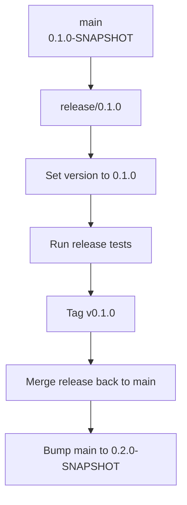
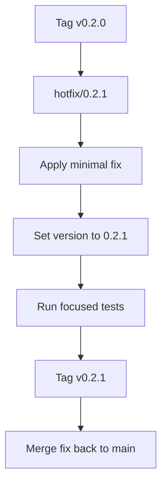

# Versioning and Branching

This document defines the versioning and branching model for
CoverageX while the project is still evolving iteratively.

## Versioning Model

CoverageX follows a simple SemVer-style model:

```text
MAJOR.MINOR.PATCH
```

While the project is not yet stable, releases use the `0.x.y` range:

```text
0.1.0-SNAPSHOT  active development toward 0.1.0
0.1.0           stable 0.1.0 release
0.2.0-SNAPSHOT  active development toward 0.2.0
0.2.0           stable 0.2.0 release
0.2.1           bugfix release for 0.2.0
```

### What SNAPSHOT Means

A `SNAPSHOT` version is an in-development build. It is allowed to change over
time and should not be treated as a final release.

For example:

```xml
<version>0.1.0-SNAPSHOT</version>
```

means:

```text
Work toward 0.1.0 is in progress.
The artifact may change between builds.
The version is not a stable release.
```

Released versions remove the `SNAPSHOT` suffix:

```text
0.1.0-SNAPSHOT -> 0.1.0
```

Once a release version is published and tagged, it should be treated as
immutable.

## Pre-1.0 Version Rules

Before `1.0.0`, use this interpretation:

| Change type | Version bump | Example |
| --- | --- | --- |
| New feature or meaningful behavior change | Minor | `0.1.0` -> `0.2.0` |
| Bug fix only | Patch | `0.2.0` -> `0.2.1` |
| JDK floor increase or major contract break | Minor for now, major after 1.0 | `0.2.0` -> `0.3.0` |

After `1.0.0`, follow stricter SemVer:

| Change type | Version bump |
| --- | --- |
| Breaking public API, plugin, report format, or compatibility contract | Major |
| Backward-compatible feature | Minor |
| Backward-compatible bug fix | Patch |

## Branching Model

It is a trunk-based model with short-lived branches:

```text
main
feature/*
fix/*
docs/*
release/*
hotfix/*
```

### Branch Purposes

| Branch | Purpose | Example |
| --- | --- | --- |
| `main` | Primary integration branch and next development version | `main` at `0.2.0-SNAPSHOT` |
| `feature/*` | New functionality | `feature/html-report` |
| `fix/*` | Bug fixes before a release | `fix/null-branch-rendering` |
| `docs/*` | Documentation-only changes | `docs/versioning-policy` |
| `release/*` | Optional stabilization branch for a release | `release/0.2.0` |
| `hotfix/*` | Urgent fix based on a released version | `hotfix/0.2.1` |

## Release Flow

When the next version is ready to stabilize, create a release branch if needed:



For small releases, the release branch may be skipped and the release can be
prepared directly from `main`.

## Hotfix Flow

Use a hotfix branch when a released version needs an urgent patch:



Hotfixes should be narrow. If the fix is not urgent for released users, prefer
normal development through `main`.

## Example Timeline

```text
main: 0.1.0-SNAPSHOT
  feature/html-report
  feature/maven-plugin-polish
  fix/global-coverage-percentage

release/0.1.0
  version: 0.1.0
  tag: v0.1.0

main: 0.2.0-SNAPSHOT
  feature/gradle-plugin
  feature/test-attribution

release/0.2.0
  version: 0.2.0
  tag: v0.2.0

hotfix/0.2.1
  version: 0.2.1
  tag: v0.2.1
```

## Build Identification

Do not add commit hashes or build numbers directly to the Maven version.

Prefer:

```text
Version: 0.1.0-SNAPSHOT
Commit:  a1b2c3d
Branch:  feature/html-report
Built:   2026-06-20T14:30:00Z
```

Avoid:

```text
0.1.0-SNAPSHOT-a1b2c3d
0.1.0-SNAPSHOT-build-142
```

The Maven project version should stay simple. Exact build identity belongs in
build metadata, logs, manifests, reports, or generated diagnostic output.

## Commit Message Style

Use lightweight Conventional Commit prefixes:

```text
feat: add Gradle aggregation report
fix: handle never-loaded classes in HTML summary
docs: document JDK toolchain setup
test: add JDK 25 fixture coverage
refactor: split report model serialization
chore: bump ASM to 9.9
```

This keeps history readable and makes release notes easier to generate later.

## Release Checklist

Before tagging a release:

- Confirm the intended version is set in the parent Maven POM.
- Run the relevant Maven test suite.
- Run compatibility matrix rows when the change can affect JDK behavior.
- Update documentation for user-visible behavior.
- Write release notes or a short changelog entry.
- Tag the release as `vX.Y.Z`.
- Bump `main` to the next `-SNAPSHOT` version.

